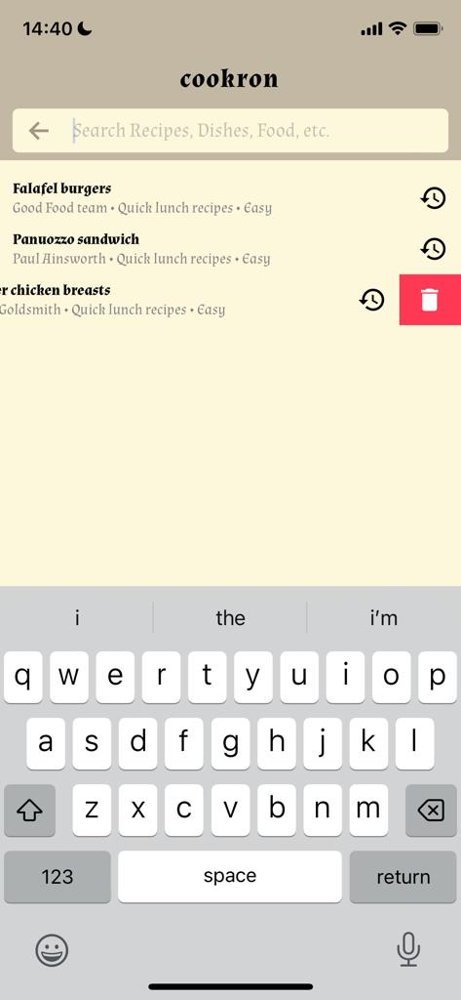

### cookron

This is a mobile application that you can explore recipes from different Chef and learn how to cook certain recipes.

<p align="center"></p>

This project contains the following main packages:

1. `mobile` - a react native mobile application to consume the api
2. `api` - is a `deno` and `oak` server that serves data that is stored in a `mongodb` cloud server.
3. `server` - a deployed version of the server that also serves `recipes` from `json` file and also does recipe reccomentations to the app user.

### Demo

The app UI looks as follows:

<p align="center">
    
    
    
    
    
    
    
</p>

> You can download the `apk` file for android of this app at [cookron](https://expo.dev/artifacts/eas/hUeRZyqdyEEUSSzLEsyxTB.apk).

### How does `cookron` works?

- Any user can use the app without creating an account or without `authentication`.
- The application requires you to have active internet connections to load recipes from the server you can like recipes and they will be saved to your `bookmarks` and you will be able to view them offline.
- Reacting or liking recipes also comes with some benefits such as:
  - you get recommendation of recipes based on the recipes you recently like.
  - you can also view recipes offline without active internet connection.

<p align="center">
    
</p>

- There are `5` tabs or recipe categories that you can explore on this app with are:

  1. `recipes` - general recipes
  2. `health` - recipes about health food
  3. `inspiration` - recipes for inspirations and special days like birthdays
  4. `budget` - recipes that does not require much money
  5. `baking` - recipes about backing things

<p align="center">
    
</p>

- You can also search from these recipes categories to filter them and get the recipe that you want.

* This app is also empowered with a simple powerful searching algorithm that helps you to get recipes that are similar to your keyword search.
* When searching recipes we keep in track of your search history

  - Note that the search history is not used in this case to recommend you recipes, but to improve the user experience on this app.

    <p align="center">
      
  </p>

  - Search history can be cleared in the app `settings`.
  - If you don't want us to track your search history you can disable it in the `settings`.

<p align="center">
      
  </p>

- A user of the app also can change the app settings in the `settings`.

<p align="center">
    
</p>

### How does recommendation algorithms works?

1. to users that doesn't have `bookmarks`

- To new users or to users that doesn't have recipes in their `bookmarks`/`favorites`/`liked` the we will use what we will use demographic recommendation algorithm. The idea behind this algorithm is very simple that **users products based on the context that, recipes that are popular and critically acclaimed will have a higher probability of being liked by the average audience.**

* So this is the general recommendation algorithm that we are using.

2. to users that have `bookmarks`

- Old users or users that have recipes in their `bookmarks`/`favorites`/`liked` we use the last recipe to recommend the rest of the recipes that are close to that a process known as `content-filtering`. The idea behind this algorithm is simple as it assumes that **that if a person liked a particular recipe, he or she will also like an recipe that is similar to it**.

3. when the user search

- when teh user searches for a `recipe` we are going to use `content-filtering` to recommend the similar recipes that she/he can view.

### LICENSE

In this project I'm using the `MIT` license which reads as follows:

```
MIT License

Copyright (c) 2023 crispengari

Permission is hereby granted, free of charge, to any person obtaining a copy
of this software and associated documentation files (the "Software"), to deal
in the Software without restriction, including without limitation the rights
to use, copy, modify, merge, publish, distribute, sublicense, and/or sell
copies of the Software, and to permit persons to whom the Software is
furnished to do so, subject to the following conditions:

The above copyright notice and this permission notice shall be included in all
copies or substantial portions of the Software.

THE SOFTWARE IS PROVIDED "AS IS", WITHOUT WARRANTY OF ANY KIND, EXPRESS OR
IMPLIED, INCLUDING BUT NOT LIMITED TO THE WARRANTIES OF MERCHANTABILITY,
FITNESS FOR A PARTICULAR PURPOSE AND NONINFRINGEMENT. IN NO EVENT SHALL THE
AUTHORS OR COPYRIGHT HOLDERS BE LIABLE FOR ANY CLAIM, DAMAGES OR OTHER
LIABILITY, WHETHER IN AN ACTION OF CONTRACT, TORT OR OTHERWISE, ARISING FROM,
OUT OF OR IN CONNECTION WITH THE SOFTWARE OR THE USE OR OTHER DEALINGS IN THE
SOFTWARE.

```
